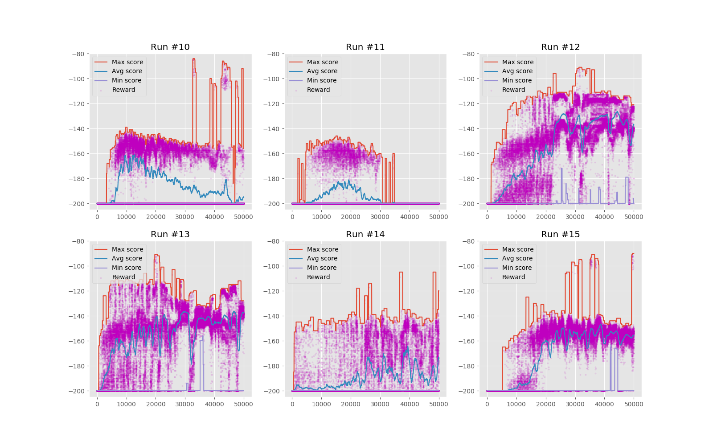

# Q-Learning
### Content
1. Results
1. Parameters
1.  Graph Compare
1. Videos of Q-table
1. Conclusion

## Results:
It is possible to beat this game with score better than `-100`. My best runs do this with reward `~115` (closer the **0**, the better)

##### Graph info
- Graphs are smoothed with time frame: `500` or `1000`.
- Rewards are scattered as they are.

### Parameters used:
```
RUN:  10, Episodes:  50000, Discount: 0.40, Learning-rate: 0.10, Spaces:  40, Eps-init: 0.5000, Eps-end: 0.0050, Eps-decay-at:  12500
RUN:  11, Episodes:  50000, Discount: 0.40, Learning-rate: 0.30, Spaces:  40, Eps-init: 0.5000, Eps-end: 0.0050, Eps-decay-at:  25000
RUN:  12, Episodes:  50000, Discount: 1.00, Learning-rate: 0.15, Spaces:  35, Eps-init: 0.4000, Eps-end: 0.0050, Eps-decay-at:  25000
RUN:  13, Episodes:  50000, Discount: 1.00, Learning-rate: 0.15, Spaces:  25, Eps-init: 0.1000, Eps-end: 0.0050, Eps-decay-at:  25000
RUN:  14, Episodes:  50000, Discount: 0.70, Learning-rate: 0.20, Spaces:  20, Eps-init: 0.1000, Eps-end: 0.0050, Eps-decay-at:  25000
RUN:  15, Episodes:  50000, Discount: 0.50, Learning-rate: 0.05, Spaces:  40, Eps-init: 0.6000, Eps-end: 0.0050, Eps-decay-at:  25000
RUN:  16, Episodes:  50000, Discount: 1.10, Learning-rate: 0.15, Spaces:  40, Eps-init: 0.6000, Eps-end: 0.0050, Eps-decay-at:  25000
RUN:  17, Episodes:  50000, Discount: 1.10, Learning-rate: 0.40, Spaces:  40, Eps-init: 0.4500, Eps-end: 0.0500, Eps-decay-at:  25000
RUN:  18, Episodes:  50000, Discount: 1.10, Learning-rate: 0.20, Spaces:  40, Eps-init: 0.4500, Eps-end: 0.0100, Eps-decay-at:  25000
RUN:  19, Episodes:  50000, Discount: 1.15, Learning-rate: 0.10, Spaces:  40, Eps-init: 0.5000, Eps-end: 0.0100, Eps-decay-at:  25000
```

### Compared runs 
##### 10-11-12-13
This section had numeric problem, we can see it in videos, where some Q-values are best for more then one action, which is very bad! I was not awere of this.


##### 15-16-17-18
Solved numeric problems, its very rare, less than 10 in each table which size is huge:`3xNxN`, `N` is size of discrete state `<20, 40>`
Fixed parameters also fixed learning curve.


### Q-table changing over time (videos)

Good run 16:

[](https://www.youtube.com/watch?v=93LEnFN1phs)

Bad run 11:

[](https://www.youtube.com/watch?v=AXFMH06SnAI)

### Conclusion. Which one is the best?
Depends on the criteria, we can select from this three values:
- Max
- Min
- Average

Comparing these graphs, we can see that best run was **#16**, it had very good minimum score, **minimum is best criterion**, because we want our agent to be `successul` at most times!

Average value is also good criterion, it shows us how agents were.  